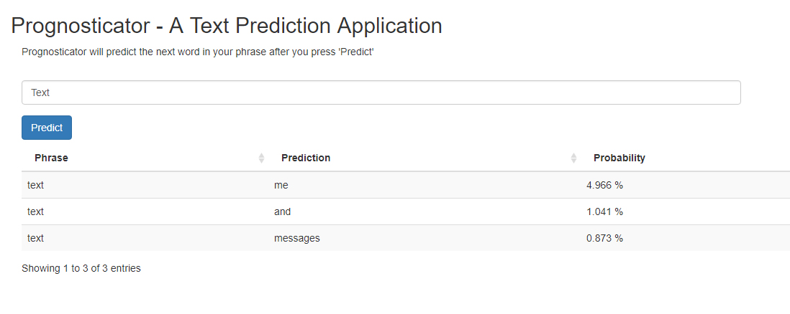

Prognosticator - A Lexical Prediction Application
Prognosticator 
========================================================
author: Justin R. Papreck
date: 3/22/2019
font-family: "Georgia"
autosize: 

This presentation will highlight the [Prognosticator](https://jrumpelstiltskin.shinyapps.io/Prognosticator/) application and its capability to predict the next word in a customized string input. This is the final project in the Coursera Data Science Specialization through Johns Hopkins University in concordance with Swiftkey.

It's on the tip of my tongue...
========================================================
If you have ever tried to explain English grammar, you have probably realized the complexities of the language and, furthermore, the exceptions to almost every rule. For this reason, the field of Natural Language Processing is a very valuable field. By using algorithms and a data science approach to language, we use the ever-evolving language data from the internet to help make better predictions for the best word to use next. 
  
Perhaps one of the best uses for this application is with idiomatic expressions and correct usage of idiomatic prepositions. For a non-native English speaker, these phrases can be extremely difficult to learn. For these lexical enigmas, we have the Prognosticator!

How it Works
========================================================
Prognosticator uses corpora from News, Blogs, and Twitter to analyze modern English text. During preprocessing, the text is reduced to lower case and punctuation is removed. The Quanteda package is used for ngram (grouped words) tokenization. The last word from each ngram is cut, and this word becomes the predictor for the matching previous string.  

Prognosticator's predictive model is a [Stupid Backoff Model](https://www.aclweb.org/anthology/D07-1090.pdf). The Stupid Backoff is less complex and computationally expensive than other models. This model is ideal with very large datasets and well suited for this application. The backoff model calculates the highest ngram probabilities and then backs off to each smaller ngram, discounting the probability with each step.   

Features
========================================================
- <b>Fast</b>: The Stupid Backoff runs only compares the input text with precalculated tokens and their probabilities from an existing data set, so this model is lightweight and fast.

- <b>Filtered</b>: Prognosticator will accept profanities as input strings, but the predictive word bank has been purged of all profanities. While the algorithm can make a prediction using profane text, it cannot deliver a profanity as a suggestion.

- <b>Forecasts</b>: Prognosticator can predict the ideal preposition or article to use in idiomatic expressions. 

- <b>Foolproof</b>: In cases of unknown or misspelled words, Prognosticator will work backward through the last word to make predictions based on letter combinations of the input. 

The Prognosticator Application
========================================================
- Prognosticator is a lightweight application that can be used to predict the next word from an input string of text.
- Simple to use: just type in your text and click on the "Predict" button. 
- Available now in ShinyApps: [Prognosticator](https://jrumpelstiltskin.shinyapps.io/Prognosticator/)

Summary
========================================================
- The preprocessing used the R package "Quanteda" to tokenize and reshape the corpora data
- The Stupid Backoff model identifies the probabilites of occuring word phrases with input
- The algorithm can make predictions using up to 4-grams and with unknown words
- Additional information can be found at the gitHub repo [Prognostications](https://github.com/FreshOats/Prognostications)
- All acknowledgements and references can be found at the above link
